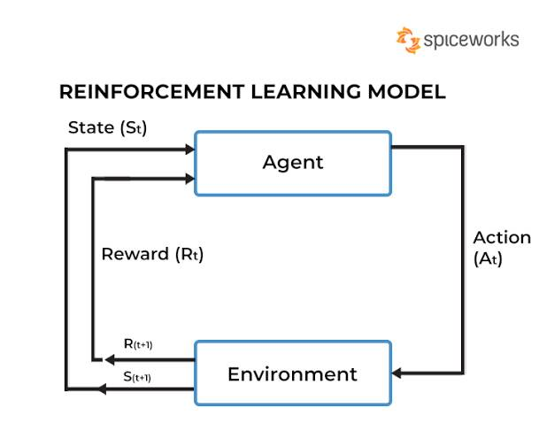

# Homework 0

After you have done following instruction let continue on to HW part.

For this first homework, we will start with training RL Agent by using classic `Cartpole` control environment as an example of how ideally the RL training process should be like.

### Part 1: Playing with `Cartpole` RL Agent [[link](https://isaac-sim.github.io/IsaacLab/main/source/tutorials/03_envs/run_rl_training.html#training-with-an-rl-agent)]

You can try to play with 

Environment:
- `omni.isaac.lab_tasks.manager_based.classic.cartpole.cartpole_env_cfg.py` 

Agent:
- `omni.isaac.lab_tasks.manager_based.classic.cartpole.agents.sb3_ppo_cfg.yaml` 

Then training RL agent again, compare experiment result and report.

`Hint:` compare tensorboard logs

### Part 2: Playing with others available enviroments [Optional] [[link](https://isaac-sim.github.io/IsaacLab/main/source/overview/environments.html#available-environments)]

### Part 3: Mapping learned knowledge with RL fundamental knowledge in classes.

1. Answer following question

`Hint:` 

### Learning Criteria:

1.  See the process pipeline when training RL in IsaacLab

    - Environment & Agent Setup
    - Training agent
    - Testing agent performance

        - Viewing learning performance logs
        - Viewing trained agent play in environment

2. Understand IsaacLab workflow `Manager-Based RL Environment` as a fundamental knowledge for implementation your RL setup in IsaacLab.

    - Action
    - Observation
    - Event
    - Reward
    - Termination

3. Can Mapping learned knowledge with RL fundamental knowledge

