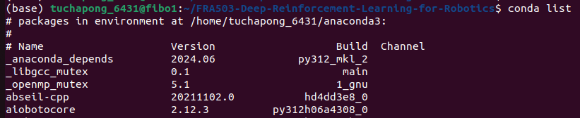
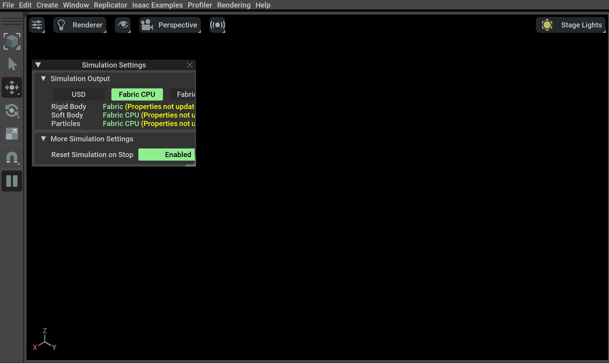
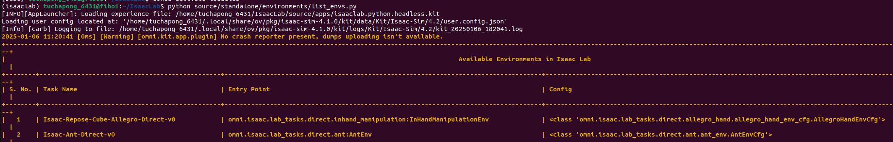

# FRA503 Deep Reinforcement Learning for Robotics

# Instruction

## Recommend using [Miniconda](https://docs.anaconda.com/miniconda/install/#quick-command-line-install)

Download Miniconda different version, IsaacLab using python version 3.10 [[list of Miniconda](https://repo.anaconda.com/miniconda)].

```
curl -O https://repo.anaconda.com/miniconda/Miniconda3-py310_24.11.1-0-Linux-x86_64.sh
```

Install Miniconda

```
bash ~/Miniconda3-latest-Linux-x86_64.sh
```

The installer finishes and displays, “Thank you for installing Miniconda3!”

Close and re-open your terminal window for the installation to fully take effect, or use the following command to refresh the terminal

```
source ~/.bashrc
```

### Verifying the Miniconda installation

Test your installation by running `conda list`. If conda has been installed correctly, a list of installed packages appears.



If you see this, then the installation was successful! 🎉

## Installing Isaac Sim & Isaac Lab

### Pip Installation (recommended for Ubuntu 22.04)

Follow the Installing and Verifying steps [[link](https://isaac-sim.github.io/IsaacLab/main/source/setup/installation/pip_installation.html)]

### Binary Installation (recommended for Ubuntu 20.04)

Follow the Installing and Verifying steps [[link](https://isaac-sim.github.io/IsaacLab/main/source/setup/installation/binaries_installation.html)]

### Verifying the Isaac Lab installation

```
# Option 1: Using the isaaclab.sh executable
# note: this works for both the bundled python and the virtual environment
./isaaclab.sh -p source/standalone/tutorials/00_sim/create_empty.py

# Option 2: Using python in your virtual environment
python source/standalone/tutorials/00_sim/create_empty.py
```



If you see this, then the installation was successful! 🎉


## Isaac Lab Overview 

For more understanding of IsaacLab you can go through Isaac Lab Overview.

1. **Core Concepts** [[link](https://isaac-sim.github.io/IsaacLab/main/source/overview/core-concepts/index.html)]
2. **Developer’s Guide** [Optional] [[link](https://isaac-sim.github.io/IsaacLab/main/source/overview/developer-guide/index.html)] 
3. **Sensors** [Optional] [[link](https://isaac-sim.github.io/IsaacLab/main/source/overview/sensors/index.html)]

## Available Environments

The following lists comprises of all the `RL tasks` implementations that are available in Isaac Lab. [[link](https://isaac-sim.github.io/IsaacLab/main/source/overview/environments.html)]

or

you can excute following command line

```
python source/standalone/environments/list_envs.py
```



## Tutorials

We recommend that you go through the tutorials in the order they are listed here.

### Simulation Overview 

1. **Setting up a Simple Simulation** 

    1.1 Creating an empty scene [[link](https://isaac-sim.github.io/IsaacLab/main/source/tutorials/00_sim/create_empty.html)] 

    1.2 Spawning prims into the scene [[link](https://isaac-sim.github.io/IsaacLab/main/source/tutorials/00_sim/spawn_prims.html)]

    1.3 Deep-dive into AppLauncher [[link](https://isaac-sim.github.io/IsaacLab/main/source/tutorials/00_sim/launch_app.html)] 

2. **Interacting with Assets** 

    2.1 Interacting with a rigid object [[link](https://isaac-sim.github.io/IsaacLab/main/source/tutorials/01_assets/run_rigid_object.html)]

    2.2 Interacting with an articulation [[link](https://isaac-sim.github.io/IsaacLab/main/source/tutorials/01_assets/run_articulation.html)]

3. **Creating a Scene**

    3.1 Using the Interactive Scene [[link](https://isaac-sim.github.io/IsaacLab/main/source/tutorials/02_scene/create_scene.html)]

### Task Design Workflows

For more detail of different workflows for designing environments. [[link](https://isaac-sim.github.io/IsaacLab/main/source/overview/core-concepts/task_workflows.html)]

4. **Designing an Environment** [[link](https://isaac-sim.github.io/IsaacLab/main/source/tutorials/index.html#designing-an-environment)]

    `HW0 Requirement`: You need to understand `Creating a Manager-Based Base Environment` and `Creating a Manager-Based RL Environment` for designing an environment.

    4.1 `Creating a Manager-Based Base Environment` [[link](https://isaac-sim.github.io/IsaacLab/main/source/tutorials/03_envs/create_manager_base_env.html)]

    4.2 `Creating a Manager-Based RL Environment` [[link](https://isaac-sim.github.io/IsaacLab/main/source/tutorials/03_envs/create_manager_rl_env.html)]

    4.3 `Registering an Environment` [[link](https://isaac-sim.github.io/IsaacLab/main/source/tutorials/03_envs/register_rl_env_gym.html#registering-an-environment)]

    4.4 `Training with an RL Agent` [[link](https://isaac-sim.github.io/IsaacLab/main/source/tutorials/03_envs/run_rl_training.html#training-with-an-rl-agent)]

## How-to Guides [Optional]

This section includes guides that help you use Isaac Lab. 
These are intended for users who have already worked through the tutorials and are looking for more information on how to use Isaac Lab. 
If you are new to Isaac Lab, we recommend you start with the tutorials. [[link](https://isaac-sim.github.io/IsaacLab/main/source/how-to/index.html#how-to-guides)]
